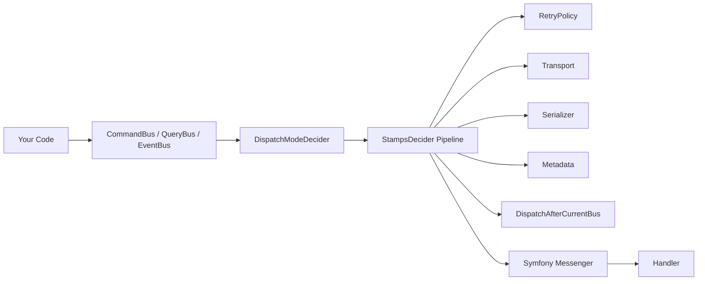

# SomeWork CQRS Bundle

[](https://github.com/somework/cqrs/actions/workflows/ci.yml)
[](https://codecov.io/gh/somework/cqrs)
[](https://phpstan.org/)
[](LICENSE)
[](https://packagist.org/packages/somework/cqrs-bundle)
[](https://packagist.org/packages/somework/cqrs-bundle)

A Symfony bundle that wires Command, Query, and Event buses on top of Symfony Messenger. It auto-discovers handlers via PHP attributes, provides a configurable stamp pipeline, and ships with testing utilities and production-grade patterns.

## Why this bundle?

Symfony Messenger is a powerful transport layer, but it leaves CQRS wiring as an exercise for the developer. This bundle fills the gap:

- **Auto-discovery** -- Annotate handlers with `#[AsCommandHandler]`, `#[AsQueryHandler]`, or `#[AsEventHandler]` and they are registered automatically. No YAML tags, no manual wiring.
- **Stamp pipeline** -- A composable `StampDecider` pipeline attaches retry policies, transport routing, serializer stamps, metadata, and dispatch-after-current-bus stamps per message type or per individual message class.
- **Type-safe buses** -- Three dedicated buses (`CommandBus`, `QueryBus`, `EventBus`) with distinct semantics: commands support sync/async dispatch, queries always return a result, events are fire-and-forget with zero-to-many handlers.
- **Testing utilities** -- `FakeCommandBus`, `FakeQueryBus`, `FakeEventBus` with `assertDispatched()`, `assertNotDispatched()`, and callback-based property assertions for fast, isolated unit tests.

### Architecture



### How does it compare?

| Capability | Raw Messenger | CQRS Bundle | Ecotone |
|---|---|---|---|
| **Handler discovery** | Manual YAML tags or `#[AsMessageHandler]` | `#[AsCommandHandler]` / `#[AsQueryHandler]` / `#[AsEventHandler]` with auto-discovery | Attribute-based with conventions |
| **Type safety** | Single `MessageBusInterface` | Separate `CommandBus`, `QueryBus`, `EventBus` with typed dispatch methods | Separate gateway interfaces |
| **Bus abstraction** | You build it | Three buses with sync/async routing, `DispatchMode` enum | Command/Query/Event buses built-in |
| **Retry configuration** | Per-transport YAML only | Per-message-class via `RetryPolicy` interface + resolver hierarchy | Per-endpoint via attributes |
| **Testing support** | `InMemoryTransport` | `FakeBus` implementations with `assertDispatched()` + callback assertions | Test support module |
| **Async routing** | `routing` YAML config | `DispatchMode` + `#[Asynchronous]` attribute + per-message transport mapping | Async via polled endpoints |
| **Stamp pipeline** | Manual stamp attachment | Composable `StampDecider` pipeline with priority ordering | Interceptors (before/after/around) |
| **Event ordering** | Not built-in | `SequenceAware` interface + `AggregateSequenceStamp` | Built-in aggregate versioning |
| **Transactional outbox** | Not built-in | `OutboxStorage` interface + DBAL implementation | Built-in with Doctrine |
| **Sagas / Process managers** | Not built-in | Not built-in | Built-in saga support |
| **Event sourcing** | Not built-in | Not built-in | Built-in event sourcing |
| **OpenTelemetry** | Not built-in | Bridge middleware with trace spans | Not built-in |
| **Learning curve** | Low (part of Symfony) | Low (thin layer over Messenger) | Moderate (own conventions) |
| **Dependencies** | Symfony only | Symfony Messenger | Ecotone framework |

> **Choose raw Messenger** when your app has simple dispatch needs and you want zero additional dependencies.
> **Choose this bundle** when you want structured CQRS buses, per-message configuration, and testing utilities while staying close to Messenger.
> **Choose Ecotone** when you need sagas, event sourcing, or a full CQRS/ES framework.

### Feature matrix

**Core**
- CommandBus with sync/async dispatch and result extraction
- QueryBus with single-handler validation and typed results
- EventBus with zero-to-many handlers and fire-and-forget semantics
- Attribute-based handler discovery (`#[AsCommandHandler]`, `#[AsQueryHandler]`, `#[AsEventHandler]`)
- Handler interfaces optional -- attributes alone are sufficient

**Stamp Pipeline**
- Composable `StampDecider` system with priority ordering (`@api` -- extend it yourself)
- Per-message retry policies via `RetryPolicy` interface
- Per-message transport routing with `TransportNamesStamp` or `SendMessageToTransportsStamp`
- Per-message serializer stamps
- Per-message metadata stamps with correlation ID support
- `DispatchAfterCurrentBusStamp` control per message

**Patterns**
- Causation ID propagation across nested dispatches
- Idempotency bridge (`IdempotencyStamp` to `DeduplicateStamp`)
- Event ordering with `SequenceAware` and `AggregateSequenceStamp`
- Rate limiting via Symfony Rate Limiter integration
- Transactional outbox with DBAL storage and relay command

**Developer Experience**
- `FakeCommandBus`, `FakeQueryBus`, `FakeEventBus` for unit testing
- `assertDispatched()` / `assertNotDispatched()` with callback-based property assertions
- `somework:cqrs:generate` scaffold command for messages and handlers
- `somework:cqrs:list` handler catalogue
- `somework:cqrs:debug-transports` transport diagnostics
- `somework:cqrs:health-check` for monitoring

**Observability**
- OpenTelemetry bridge middleware (trace spans for dispatch and handling)
- PSR-3 structured logging across buses, deciders, and resolvers

**Integration**
- Symfony Flex recipe for zero-touch installation
- `CommandBusInterface`, `QueryBusInterface`, `EventBusInterface` for DI and testing
- `#[Asynchronous]` attribute for transport routing without YAML config

## Installation

### Requirements

* PHP 8.2 or newer.
* Symfony 7.2 or newer.

### With Symfony Flex (recommended)

```bash
composer require somework/cqrs-bundle
```

Flex automatically registers the bundle in `config/bundles.php` and creates a
commented `config/packages/somework_cqrs.yaml` with all available options.

### Without Symfony Flex

Install the bundle via Composer:

```bash
composer require somework/cqrs-bundle
```

Then register it manually in `config/bundles.php`:

```php
return [
    // ...
    SomeWork\CqrsBundle\SomeWorkCqrsBundle::class => ['all' => true],
];
```

Create `config/packages/somework_cqrs.yaml` (see `docs/flex-recipe/` for a
template with all available options).

### Verify the installation

Run the bundled console tooling to verify the bundle is registered:

```bash
bin/console somework:cqrs:list
```

> **Flex Recipe:** The recipe files are in `docs/flex-recipe/` and are pending
> submission to [symfony/recipes-contrib](https://github.com/symfony/recipes-contrib).
> Until published, manual bundle registration is required.

## Quick start

### Step 1 -- Define a command message

```php
namespace App\Application\Command;

use SomeWork\CqrsBundle\Contract\Command;

final class CreateTask implements Command
{
    public function __construct(
        public readonly string $id,
        public readonly string $name,
    ) {}
}
```

### Step 2 -- Create the handler

```php
namespace App\Application\Command;

use SomeWork\CqrsBundle\Attribute\AsCommandHandler;
use SomeWork\CqrsBundle\Contract\CommandHandler;

#[AsCommandHandler(command: CreateTask::class)]
final class CreateTaskHandler implements CommandHandler
{
    public function __invoke(CreateTask $command): mixed
    {
        // Save task to database...
        return null;
    }
}
```

### Step 3 -- Inject the bus and dispatch

```php
namespace App\Controller;

use App\Application\Command\CreateTask;
use SomeWork\CqrsBundle\Contract\CommandBusInterface;
use Symfony\Component\HttpFoundation\JsonResponse;
use Symfony\Component\HttpFoundation\Request;
use Symfony\Component\Routing\Attribute\Route;

final class TaskController
{
    #[Route('/tasks', methods: ['POST'])]
    public function create(Request $request, CommandBusInterface $commandBus): JsonResponse
    {
        $data = $request->toArray();

        $commandBus->dispatch(new CreateTask(
            id: uuid_create(),
            name: $data['name'],
        ));

        return new JsonResponse(['status' => 'ok'], 201);
    }
}
```

## Documentation

Full documentation is available at **[somework.github.io/cqrs](https://somework.github.io/cqrs/)**.

* [Getting Started](docs/getting-started.md) -- progressive tutorial from install to advanced patterns
* [Usage Guide](docs/usage.md) -- core patterns, dispatch modes, console commands
* [Configuration Reference](docs/reference.md) -- every `somework_cqrs` option explained
* [Testing Guide](docs/testing.md) -- FakeBus, assertions, integration testing
* [Production Guide](docs/production.md) -- deployment, workers, monitoring
* [Troubleshooting](docs/troubleshooting.md) -- common issues and solutions
* [Upgrade Guide](UPGRADE.md) -- migration between versions
* [Changelog](CHANGELOG.md)

### Advanced topics

* [Retry Policies](docs/retry.md)
* [Transactional Outbox](docs/outbox.md)
* [Event Ordering](docs/event-ordering.md)
* [Idempotency](docs/idempotency.md)
* [Rate Limiting](docs/rate-limiting.md)

## License

MIT. See [LICENSE](LICENSE).
