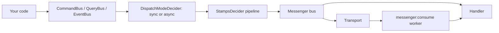

# SomeWork CQRS Bundle

[](https://github.com/somework/cqrs/actions/workflows/ci.yml)
[](https://codecov.io/gh/somework/cqrs)
[](https://phpstan.org/)
[](LICENSE)
[](https://packagist.org/packages/somework/cqrs-bundle)
[](https://packagist.org/packages/somework/cqrs-bundle)

A Symfony bundle that wires Command, Query, and Event buses on top of Symfony Messenger. It auto-discovers handlers via PHP attributes, provides a configurable stamp pipeline, and ships with testing utilities and optional patterns such as a transactional outbox, idempotency, and rate limiting.

## Why this bundle?

Symfony Messenger is a powerful transport layer, but it leaves CQRS wiring as an exercise for the developer. This bundle fills the gap:

- **Auto-discovery** -- Annotate handlers with `#[AsCommandHandler]`, `#[AsQueryHandler]`, or `#[AsEventHandler]` and they are registered automatically, on the synchronous bus and (when configured) on the asynchronous bus of their type. No YAML tags, no manual wiring.
- **Stamp pipeline** -- A composable `StampDecider` pipeline attaches retry policies, transport routing, serializer stamps, metadata, and dispatch-after-current-bus stamps per message type or per individual message class.
- **Dedicated buses** -- `CommandBus`, `QueryBus`, and `EventBus` with distinct semantics: commands support sync/async dispatch and can return a result, queries return the result of exactly one handler, events are fire-and-forget with zero-to-many handlers.
- **Testing utilities** -- `FakeCommandBus`, `FakeQueryBus`, and `FakeEventBus` record dispatched messages; `CqrsAssertionsTrait` adds `assertDispatched()` and `assertNotDispatched()` with callback-based property checks.

### Architecture


```mermaid
flowchart LR
    A[Your code] --> B[CommandBus / QueryBus / EventBus]
    B --> C[DispatchModeDecider: sync or async]
    C --> D[StampsDecider pipeline]
    D --> E[Messenger bus]
    E --> F[Handler]
    E --> G[Transport]
    G --> H[messenger:consume worker]
    H --> F
```

The stamp pipeline runs the built-in deciders for rate limiting, retry policies, the `#[Asynchronous]` attribute, transport names, serializers, metadata, event sequence numbers, causation IDs, idempotency, and `DispatchAfterCurrentBusStamp`, followed by any decider you register. Queries skip the dispatch-mode step; they are always handled synchronously.

### How does it compare with plain Messenger?

| Capability | Plain Messenger | This bundle |
|---|---|---|
| **Handler discovery** | `#[AsMessageHandler]` or `messenger.message_handler` tags | `#[AsCommandHandler]` / `#[AsQueryHandler]` / `#[AsEventHandler]`, registered on the right sync and async buses |
| **Bus API** | `MessageBusInterface::dispatch()` for everything | `CommandBusInterface`, `QueryBusInterface`, `EventBusInterface` with typed methods |
| **Handler results** | Read `HandledStamp` or use `HandleTrait` | `CommandBusInterface::dispatchSync()` and `QueryBusInterface::ask()` return the result |
| **Sync/async choice** | `routing` per message class | `DispatchMode`, `#[Asynchronous]`, and per-message `dispatch_modes` configuration |
| **Retry configuration** | Per transport | Per message class or interface via `RetryPolicy`, bridged to the transport retry strategy |
| **Stamps** | Added by the caller | Composable `StampDecider` pipeline with priority ordering |
| **Testing** | `InMemoryTransport` or mocks | Fake buses plus `assertDispatched()` / `assertNotDispatched()` |
| **Event ordering** | Not built-in | `SequenceAware` interface + `AggregateSequenceStamp` |
| **Transactional outbox** | Not built-in | `OutboxStorage` interface + DBAL implementation and relay command |
| **OpenTelemetry** | Not built-in | Middleware producing dispatch and consume spans |

> **Choose plain Messenger** when your app has simple dispatch needs and you want no additional dependency.
> **Choose this bundle** when you want structured CQRS buses, per-message configuration, and testing utilities while staying close to Messenger.
> The bundle does not provide sagas, process managers, or event sourcing; use a full CQRS/ES framework if you need them.

### Features

**Core**
- `CommandBus` with sync/async dispatch; `dispatchSync()` returns the handler result
- `QueryBus::ask()` returns the result of the single handler
- `EventBus` with zero-to-many handlers and fire-and-forget semantics
- Attribute-based handler discovery (`#[AsCommandHandler]`, `#[AsQueryHandler]`, `#[AsEventHandler]`); handler marker interfaces and abstract base handlers are optional alternatives
- Compile-time check that every command and query has at most one handler per bus

**Stamp pipeline**
- Composable `StampDecider` system with priority ordering (`@api` -- extend it yourself)
- Per-message retry policies via the `RetryPolicy` interface, with a transport-level retry strategy bridge
- Per-message transport routing with Messenger's `TransportNamesStamp`
- Per-message serializer stamps
- Per-message metadata stamps with correlation and causation IDs
- `DispatchAfterCurrentBusStamp` control per message

**Patterns**
- Causation ID propagation across nested dispatches
- Idempotency bridge (`IdempotencyStamp` to Messenger's `DeduplicateStamp`)
- Event ordering metadata with `SequenceAware` and `AggregateSequenceStamp`
- Rate limiting via Symfony Rate Limiter
- Transactional outbox with DBAL storage and relay, setup, and purge commands

**Developer experience**
- `FakeCommandBus`, `FakeQueryBus`, `FakeEventBus` for unit testing
- `assertDispatched()` / `assertNotDispatched()` (in `CqrsAssertionsTrait` and `CqrsTestCase`) with callback-based property assertions
- `somework:cqrs:generate` scaffolds a message and its handler
- `somework:cqrs:list` handler catalogue
- `somework:cqrs:debug-transports` transport configuration overview
- `somework:cqrs:health` checks handlers and transports (exit codes 0/1/2 for monitoring)

**Observability**
- OpenTelemetry middleware (spans for dispatching and for consuming messages in workers, trace context carried across transports)
- PSR-3 logging across buses, deciders, and resolvers

**Integration**
- `CommandBusInterface`, `QueryBusInterface`, `EventBusInterface` for dependency injection and test doubles
- `#[Asynchronous]` attribute to make a message asynchronous without per-message YAML

## Installation

### Requirements

* PHP 8.2 or newer.
* Symfony 7.2 or newer, including 8.x (FrameworkBundle and Messenger).

Optional packages enable additional features:

* `symfony/messenger` 7.3+ and `symfony/lock` -- idempotency (`IdempotencyStamp`).
* `symfony/rate-limiter` -- rate limiting.
* `doctrine/dbal` 4 and `doctrine/doctrine-bundle` -- transactional outbox.
* `open-telemetry/api` 1.8+ -- tracing.

### Install the package

```bash
composer require somework/cqrs-bundle
```

With Symfony Flex the bundle is added to `config/bundles.php` automatically. Without Flex, register it manually:

```php
// config/bundles.php
return [
    // ...
    SomeWork\CqrsBundle\SomeWorkCqrsBundle::class => ['all' => true],
];
```

No configuration file is required: by default every bus uses Messenger's default bus and all messages are handled synchronously. To customise the bundle, create `config/packages/somework_cqrs.yaml`; `docs/flex-recipe/` contains a commented template with every option, and `bin/console config:dump-reference somework_cqrs` prints the full reference. The Flex recipe is not published to [symfony/recipes-contrib](https://github.com/symfony/recipes-contrib) yet, so Flex does not create this file for you.

### Verify the installation

```bash
bin/console somework:cqrs:list
```

The command lists the registered command, query, and event handlers (or warns that none were found yet).

## Quick start

The examples below assume a standard Symfony application where everything in `src/` is registered as a service with `autowire` and `autoconfigure` enabled (the default `config/services.yaml`).

### Step 1 -- Define a command

Commands are immutable DTOs that implement the `Command` marker interface:

```php
<?php

namespace App\Task;

use SomeWork\CqrsBundle\Contract\Command;

final class CreateTask implements Command
{
    public function __construct(
        public readonly string $id,
        public readonly string $name,
    ) {
    }
}
```

### Step 2 -- Create the handler

Annotate the handler with `#[AsCommandHandler]` and type the `__invoke()` parameter with the command class:

```php
<?php

namespace App\Task;

use SomeWork\CqrsBundle\Attribute\AsCommandHandler;
use SomeWork\CqrsBundle\Contract\EventBusInterface;

#[AsCommandHandler(CreateTask::class)]
final class CreateTaskHandler
{
    public function __construct(
        private readonly EventBusInterface $eventBus,
    ) {
    }

    public function __invoke(CreateTask $command): mixed
    {
        // Persist the task...

        $this->eventBus->dispatch(new TaskCreated($command->id, $command->name));

        return $command->id;
    }
}
```

### Step 3 -- Define a query and its handler

Queries implement `Query`; their handler returns the result:

```php
<?php

namespace App\Task;

use SomeWork\CqrsBundle\Contract\Query;

final class FindTask implements Query
{
    public function __construct(
        public readonly string $id,
    ) {
    }
}
```

```php
<?php

namespace App\Task;

use SomeWork\CqrsBundle\Attribute\AsQueryHandler;

#[AsQueryHandler(FindTask::class)]
final class FindTaskHandler
{
    public function __invoke(FindTask $query): mixed
    {
        // Load the task from your storage...
        return ['id' => $query->id, 'name' => 'Write the docs'];
    }
}
```

### Step 4 -- Define an event and a listener

Events implement `Event` and may have any number of handlers, including none:

```php
<?php

namespace App\Task;

use SomeWork\CqrsBundle\Contract\Event;

final class TaskCreated implements Event
{
    public function __construct(
        public readonly string $taskId,
        public readonly string $name,
    ) {
    }
}
```

```php
<?php

namespace App\Task;

use Psr\Log\LoggerInterface;
use SomeWork\CqrsBundle\Attribute\AsEventHandler;

#[AsEventHandler(TaskCreated::class)]
final class LogTaskCreated
{
    public function __construct(
        private readonly LoggerInterface $logger,
    ) {
    }

    public function __invoke(TaskCreated $event): void
    {
        $this->logger->info('Task {id} created', ['id' => $event->taskId]);
    }
}
```

### Step 5 -- Dispatch through the buses

Inject the bus interfaces (they are autowired) and dispatch:

```php
<?php

namespace App\Controller;

use App\Task\CreateTask;
use App\Task\FindTask;
use SomeWork\CqrsBundle\Contract\CommandBusInterface;
use SomeWork\CqrsBundle\Contract\QueryBusInterface;
use Symfony\Bundle\FrameworkBundle\Controller\AbstractController;
use Symfony\Component\HttpFoundation\JsonResponse;
use Symfony\Component\HttpFoundation\Request;
use Symfony\Component\Routing\Attribute\Route;

final class TaskController extends AbstractController
{
    public function __construct(
        private readonly CommandBusInterface $commandBus,
        private readonly QueryBusInterface $queryBus,
    ) {
    }

    #[Route('/tasks', methods: ['POST'])]
    public function create(Request $request): JsonResponse
    {
        $name = $request->getPayload()->getString('name');

        // dispatchSync() handles the command right away and returns the handler result.
        $id = $this->commandBus->dispatchSync(new CreateTask(bin2hex(random_bytes(8)), $name));

        return $this->json(['id' => $id], 201);
    }

    #[Route('/tasks/{id}', methods: ['GET'])]
    public function show(string $id): JsonResponse
    {
        return $this->json($this->queryBus->ask(new FindTask($id)));
    }
}
```

`CommandBusInterface::dispatch()` returns the Messenger `Envelope` and handles the command synchronously or asynchronously depending on your configuration; `dispatchSync()` always handles it synchronously and returns the handler result. `bin/console somework:cqrs:list` now shows the three handlers.

### Step 6 (optional) -- Handle commands asynchronously

Declare an asynchronous Messenger bus and a transport, then tell the bundle about them:

```yaml
# config/packages/messenger.yaml
framework:
    messenger:
        default_bus: command.bus
        buses:
            command.bus: ~
            command.async_bus: ~
        transports:
            async: '%env(MESSENGER_TRANSPORT_DSN)%'
```

```yaml
# config/packages/somework_cqrs.yaml
somework_cqrs:
    buses:
        command: command.bus
        command_async: command.async_bus
    transports:
        command_async:
            default: [async]
```

`MESSENGER_TRANSPORT_DSN` must point to a transport you have installed (Doctrine, AMQP, Redis, ...). Now `$commandBus->dispatchAsync($command)` sends the command to the `async` transport, and so does a plain `dispatch()` of a command class marked with `#[Asynchronous]` (`SomeWork\CqrsBundle\Attribute\Asynchronous`) or mapped to `async` under `dispatch_modes.command.map`. Handlers without an explicit `bus` are registered on the async bus automatically, so the worker finds them:

```bash
bin/console messenger:consume async
```

Events work the same way with `buses.event_async` and `transports.event_async`. See the [Usage Guide](docs/usage.md) for the dispatch-mode rules.

## Documentation

Full documentation is available at **[somework.github.io/cqrs](https://somework.github.io/cqrs/)**.

* [Getting Started](docs/getting-started.md) -- tutorial from installation to async dispatch and testing
* [Usage Guide](docs/usage.md) -- handler registration, dispatch modes, exceptions, console commands
* [Configuration Reference](docs/reference.md) -- every `somework_cqrs` option explained
* [Migrating from Symfony Messenger](docs/migration.md) -- moving an existing Messenger application to the bundle
* [Middleware & Stamp Pipeline](docs/middleware.md) -- built-in middleware and stamp deciders, custom deciders
* [Testing Guide](docs/testing.md) -- fake buses, assertions, integration testing
* [Production Guide](docs/production.md) -- deployment, workers, monitoring
* [Troubleshooting](docs/troubleshooting.md) -- common issues and solutions
* [Upgrade Guide](UPGRADE.md) -- upgrading between versions of the bundle
* [Changelog](CHANGELOG.md)

### Advanced topics

* [Retry Policies](docs/retry.md)
* [Transactional Outbox](docs/outbox.md)
* [Event Ordering](docs/event-ordering.md)
* [Idempotency](docs/idempotency.md)
* [Rate Limiting](docs/rate-limiting.md)

## License

MIT. See [LICENSE](LICENSE).
