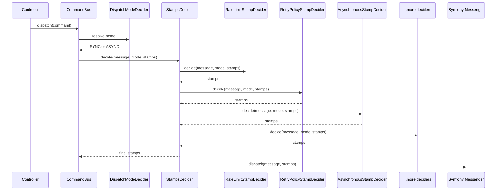

# Middleware & Stamp Pipeline

The bundle extends Symfony Messenger with two layers of extensibility:
**middleware** (Messenger's `MiddlewareInterface`) for cross-cutting concerns
during handler execution, and a **stamp decider pipeline** for adding stamps to
the message envelope before Messenger dispatch.

## How the stamp pipeline works

When a bus dispatches a message, the `StampsDecider` aggregator runs all
registered `StampDecider` implementations in priority order. Each decider
receives the message, resolved `DispatchMode`, and current stamp array, and
returns a (potentially modified) stamp array. The final stamps are passed to
Messenger's `MessageBusInterface::dispatch()`.



Deciders run from highest priority to lowest. Each decider sees the stamps added
by all higher-priority deciders.

## Middleware classes

The bundle ships three Messenger middleware classes. They are registered
automatically by the DI extension -- you do not need to configure them manually.

### AllowNoHandlerMiddleware

Silences `NoHandlerForMessageException` for messages implementing the `Event`
interface. This enables fire-and-forget event dispatching: you can publish domain
events before any listeners subscribe to them.

The middleware is added to every configured event bus (`buses.event`,
`buses.event_async`, or the `default_bus` fallback). Command and query buses
keep Messenger's default behavior, so missing handlers still surface as errors
during development.

### CausationIdMiddleware

Tracks parent-child message relationships by pushing the current message's
correlation ID onto a `CausationIdContext` stack during handler execution. Any
child messages dispatched from within the handler automatically receive the
parent's correlation ID as their `causationId`, enabling distributed tracing
across message chains.

Configure via `somework_cqrs.causation_id`:

```yaml
somework_cqrs:
    causation_id:
        enabled: true  # default
        buses:
            - somework_cqrs.bus.command  # limit to specific buses
```

Setting `enabled: false` disables both the middleware and its paired stamp
decider (`CausationIdStampDecider`). The `buses` list limits middleware
injection to specific bus service IDs -- an empty array (the default) means
all buses.

### OpenTelemetryMiddleware

Produces OpenTelemetry trace spans for message dispatch and handler execution.
Creates two spans per message:

- `cqrs.dispatch {ClassName}` (`KIND_PRODUCER`) -- wraps the full dispatch
  lifecycle
- `cqrs.handle {ClassName}` (`KIND_INTERNAL`) -- wraps handler execution

Both spans carry `cqrs.message.class` (FQCN) and `cqrs.message.type`
(`command`, `query`, or `event`) attributes. Failed handlers set the span
status to `ERROR` and record the exception.

**Prerequisites:** Requires `open-telemetry/api`:

```bash
composer require open-telemetry/api
```

The middleware is registered conditionally -- it is only added when
`TracerProviderInterface` is available in the container. When the OpenTelemetry
SDK is not installed, no spans are produced and no overhead is incurred.

## Built-in stamp deciders

The stamp pipeline is the primary extension point of the bundle. All built-in
deciders are registered with explicit priorities and can be overridden or
supplemented with custom deciders.

### RateLimitStampDecider (priority 225)

Gates message dispatch by consuming from a configured Symfony rate limiter. When
the rate limit is exceeded, logs a PSR-3 warning with the message FQCN and
retry-after duration, then throws `RateLimitExceededException`.

Registered per message type (command, query, event) when `rate_limiting` is
enabled and `symfony/rate-limiter` is installed.

```yaml
somework_cqrs:
    rate_limiting:
        command:
            map:
                App\Command\SendNotification: send_notification
```

### RetryPolicyStampDecider (priority 200)

Adds retry policy stamps based on per-message `RetryPolicy` configuration.
Resolves the policy for each message using the hierarchy-aware resolver (exact
class, parent classes, interfaces, type default, global default).

Registered separately for commands, queries, and events.

### AsynchronousStampDecider (priority 180)

Reads the `#[Asynchronous]` attribute from message classes and adds a
`TransportNamesStamp` with the configured transport name. Only applies when the
dispatch mode is not `SYNC`. Yields to any `TransportNamesStamp` already present
in the stamps array.

See [Async routing with the #[Asynchronous] attribute](usage.md#async-routing-with-the-asynchronous-attribute).

### MessageTransportStampDecider (priority 175)

Routes messages to configured transports based on the `transport` config map.
Resolves transport names per message type and dispatch mode (sync/async).
Skipped when a `TransportNamesStamp` already exists.

### MessageSerializerStampDecider (priority 150)

Adds serializer stamps based on per-message `MessageSerializer` configuration.
Resolves using the same hierarchy-aware strategy as retry policies.

Registered separately for commands, queries, and events.

### MessageMetadataStampDecider (priority 125)

Adds `MessageMetadataStamp` carrying a correlation ID and arbitrary key/value
metadata. Uses a `MessageMetadataProvider` resolved per message.

Registered separately for commands, queries, and events.

### SequenceStampDecider (priority 110)

Auto-attaches `AggregateSequenceStamp` for events implementing `SequenceAware`.
Carries `aggregateId`, `sequenceNumber`, and `aggregateType` metadata for
ordering. Enabled by default when `sequence.enabled` is `true`.

### CausationIdStampDecider (priority 100)

Injects the `causationId` from `CausationIdContext` into an existing
`MessageMetadataStamp`. Runs after metadata deciders (priority 125) so the
stamp already exists. Enabled when `causation_id.enabled` is `true`.

### IdempotencyStampDecider (priority 50)

Converts the bundle's `IdempotencyStamp` to Symfony's `DeduplicateStamp` with
an FQCN-namespaced key. Bridges the bundle's idempotency convention to
Messenger's native `DeduplicateMiddleware`. Requires `symfony/lock`. Enabled
when `idempotency.enabled` is `true`.

### DispatchAfterCurrentBusStampDecider (priority 0)

Adds `DispatchAfterCurrentBusStamp` for async dispatches so messages are queued
after the current handler finishes. Configurable per message type with global
and per-message overrides. Runs last to ensure all transport decisions are final.

## Creating custom stamp deciders

Implement the `StampDecider` interface to add custom stamps to the dispatch
pipeline. The interface is `@api` and follows semver.

### 1. Implement the interface

```php
<?php

declare(strict_types=1);

namespace App\Infrastructure\Cqrs;

use SomeWork\CqrsBundle\Bus\DispatchMode;
use SomeWork\CqrsBundle\Support\StampDecider;
use Symfony\Component\Messenger\Stamp\StampInterface;
use Symfony\Component\Security\Core\Authentication\Token\Storage\TokenStorageInterface;

final class AuditTrailStampDecider implements StampDecider
{
    public function __construct(
        private readonly TokenStorageInterface $tokenStorage,
    ) {
    }

    /**
     * @param array<int, StampInterface> $stamps
     * @return array<int, StampInterface>
     */
    public function decide(object $message, DispatchMode $mode, array $stamps): array
    {
        $user = $this->tokenStorage->getToken()?->getUser();

        $stamps[] = new AuditTrailStamp(
            userId: $user?->getUserIdentifier(),
            timestamp: new \DateTimeImmutable(),
        );

        return $stamps;
    }
}
```

The `decide()` method receives:

- `$message` -- the message object being dispatched
- `$mode` -- the resolved `DispatchMode` (`SYNC`, `ASYNC`, or `DEFAULT`)
- `$stamps` -- the current stamp array (modified by higher-priority deciders)

Return the stamp array with your additions. You can also remove or replace
existing stamps.

### 2. Register via DI tag

Register your decider with the `somework_cqrs.dispatch_stamp_decider` tag and a
`priority` attribute:

```yaml
services:
    App\Infrastructure\Cqrs\AuditTrailStampDecider:
        tags:
            - { name: 'somework_cqrs.dispatch_stamp_decider', priority: 100 }
```

With autoconfiguration enabled, implementing `StampDecider` registers the tag
automatically. Add the priority explicitly in the service definition.

### 3. Restrict to specific message types (optional)

To run your decider only for certain message types, implement
`MessageTypeAwareStampDecider`:

```php
<?php

use SomeWork\CqrsBundle\Contract\Command;
use SomeWork\CqrsBundle\Support\MessageTypeAwareStampDecider;

final class AuditTrailStampDecider implements MessageTypeAwareStampDecider
{
    /**
     * @return list<class-string>
     */
    public function messageTypes(): array
    {
        return [Command::class];
    }

    public function decide(object $message, DispatchMode $mode, array $stamps): array
    {
        // Only called for Command instances
        // ...
    }
}
```

Without `MessageTypeAwareStampDecider`, the decider runs for all message types.

### 4. Priority ordering

Higher priority values run first. Choose your priority based on when your
decider needs to run relative to the built-in deciders:

- **> 225** -- before rate limiting (pre-dispatch gates)
- **200-225** -- alongside retry and rate limiting
- **175-180** -- alongside transport routing
- **125-150** -- alongside serialization and metadata
- **50-125** -- after metadata (can read/modify metadata stamps)
- **< 50** -- after almost everything (final adjustments)

### 5. Testing a custom stamp decider

```php
<?php

use App\Infrastructure\Cqrs\AuditTrailStamp;
use App\Infrastructure\Cqrs\AuditTrailStampDecider;
use PHPUnit\Framework\TestCase;
use SomeWork\CqrsBundle\Bus\DispatchMode;
use Symfony\Component\Security\Core\Authentication\Token\Storage\TokenStorageInterface;

final class AuditTrailStampDeciderTest extends TestCase
{
    public function testAddsAuditTrailStamp(): void
    {
        $tokenStorage = $this->createMock(TokenStorageInterface::class);
        $decider = new AuditTrailStampDecider($tokenStorage);

        $message = new \stdClass();
        $stamps = $decider->decide($message, DispatchMode::SYNC, []);

        self::assertCount(1, $stamps);
        self::assertInstanceOf(AuditTrailStamp::class, $stamps[0]);
    }
}
```

The decider is a plain PHP class with no framework dependencies in its
`decide()` contract. Inject mocks for any services your decider depends on.

## Priority reference table

All built-in stamp deciders sorted by priority (highest = runs first):

| Priority | Decider | Scope | Condition |
|----------|---------|-------|-----------|
| 225 | `RateLimitStampDecider` | Per type | `rate_limiting` enabled + `symfony/rate-limiter` installed |
| 200 | `RetryPolicyStampDecider` | Per type | Always |
| 180 | `AsynchronousStampDecider` | All types | Always |
| 175 | `MessageTransportStampDecider` | All types | Always |
| 150 | `MessageSerializerStampDecider` | Per type | Always |
| 125 | `MessageMetadataStampDecider` | Per type | Always |
| 110 | `SequenceStampDecider` | Events only | `sequence.enabled` (default: true) |
| 100 | `CausationIdStampDecider` | All types | `causation_id.enabled` (default: true) |
| 50 | `IdempotencyStampDecider` | All types | `idempotency.enabled` + `symfony/lock` installed |
| 0 | `DispatchAfterCurrentBusStampDecider` | All types | Always |

"Per type" means a separate instance is registered for commands, queries, and
events. "All types" means a single instance processes all message types.
