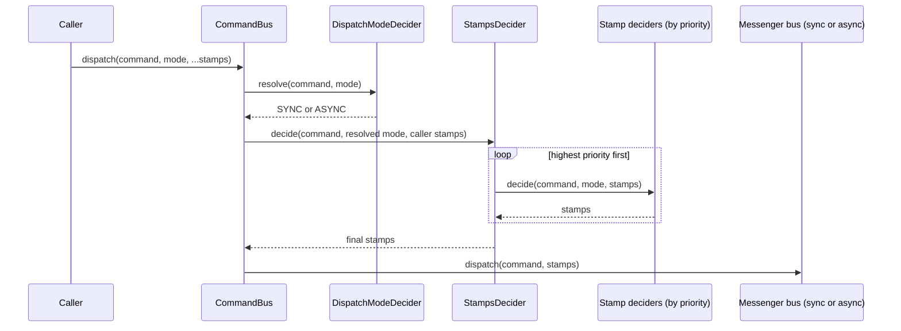

# Middleware & Stamp Pipeline

The bundle extends Symfony Messenger in two places:

* **Messenger middleware** that runs inside the Messenger buses, both when a
  message is dispatched and when a worker handles a received message.
* A **stamp decider pipeline** that runs in the CQRS facades (`CommandBus`,
  `QueryBus`, `EventBus`) before the message is handed to Messenger, and adds
  stamps to the envelope.

## How the stamp pipeline works

When a facade dispatches a message, it first resolves the dispatch mode, then
runs the `StampsDecider` aggregator. The aggregator calls every registered
`StampDecider` in priority order (highest first). Each decider receives the
message, the resolved `DispatchMode` and the current stamp array, and returns
the (possibly modified) array. The result is passed to Messenger's
`MessageBusInterface::dispatch()` on the sync or async bus.


```mermaid
sequenceDiagram
    participant C as Caller
    participant B as CommandBus
    participant D as DispatchModeDecider
    participant S as StampsDecider
    participant SD as Stamp deciders (by priority)
    participant M as Messenger bus (sync or async)

    C->>B: dispatch(command, mode, ...stamps)
    B->>D: resolve(command, mode)
    D-->>B: SYNC or ASYNC
    B->>S: decide(command, resolved mode, caller stamps)
    loop highest priority first
        S->>SD: decide(command, mode, stamps)
        SD-->>S: stamps
    end
    S-->>B: final stamps
    B->>M: dispatch(command, stamps)
```

Things to know about the pipeline:

* The initial stamps are the ones the caller passed. `dispatchSync()` and
  `ask()` remove a `DispatchAfterCurrentBusStamp` first, because they need the
  result immediately.
* Deciders receive the resolved mode, `SYNC` or `ASYNC`, never `DEFAULT`.
  `QueryBus::ask()` always passes `SYNC`.
* Each decider sees the stamps added by the deciders before it.
* The pipeline only runs for dispatches through the CQRS facades. It does not run
  when a worker handles a received message, when you dispatch on a
  `MessageBusInterface` directly, or when the outbox relay sends stored
  messages.
* **Caller stamps win.** The built-in deciders do not replace or duplicate a
  `MessageMetadataStamp`, `SerializerStamp`, `TransportNamesStamp`,
  `AggregateSequenceStamp`, `DeduplicateStamp` or `DispatchAfterCurrentBusStamp`
  passed by the caller, and an explicit causation id is kept. Retry policy
  stamps are added only for stamp classes the caller did not pass.

## Middleware classes

The bundle registers its Messenger middleware automatically; you do not list it
under `framework.messenger.buses.*.middleware`.

### Position in the bus

Each bundle middleware is inserted right after Messenger's
`dispatch_after_current_bus` middleware. Messages deferred with
`DispatchAfterCurrentBusStamp` are released later from that point of the stack,
so middleware placed before it would be skipped for them. With FrameworkBundle's
default middleware, a bus handled by the bundle looks like this (abridged;
bundle middleware in brackets):

```
add_bus_name_stamp_middleware
reject_redelivered_message_middleware
dispatch_after_current_bus
[OpenTelemetryMiddleware]              when a tracer provider is registered
[CausationIdMiddleware]                when causation_id.enabled is true
[AllowNoHandlerMiddleware]             event buses only
failed_message_processing_middleware
deduplicate_middleware                 Messenger 7.3+ with framework.lock
[DeduplicationLockReleaseMiddleware]   when the idempotency bridge is active
... your own middleware ...
send_message
handle_message
```

On a bus without `dispatch_after_current_bus` (for example with
`default_middleware: false`), the bundle middleware is placed first.
`DeduplicationLockReleaseMiddleware` is only added to buses that contain
Messenger's `deduplicate_middleware`.

The "CQRS buses" below are the bus ids the bundle uses: `default_bus` plus every
configured `buses.*` entry, with aliases resolved.

### AllowNoHandlerMiddleware

Catches Messenger's `NoHandlerForMessageException` for messages implementing
`SomeWork\CqrsBundle\Contract\Event`, so events can be published before anyone
listens to them. Any other message rethrows the exception.

It is added to the event bus (`buses.event`, or `default_bus` when that is not
set) and to `buses.event_async`. Because it only silences events, a bus shared
by commands and events still reports commands without a handler.

### CausationIdMiddleware

While a message is handled, pushes the correlation id of its
`MessageMetadataStamp` onto the `CausationIdContext` stack and pops it
afterwards (also when the handler throws). `CausationIdStampDecider` reads this
stack: a message dispatched from inside the handler gets the parent's
correlation id as its causation id.

Configure it under `somework_cqrs.causation_id`:

```yaml
somework_cqrs:
    causation_id:
        enabled: true            # default
        buses:                   # default []: all CQRS buses
            - messenger.bus.commands
```

`enabled: false` removes both the middleware and `CausationIdStampDecider`.
Entries in `buses` must be Messenger bus service ids; an unknown id fails the
container compilation. `CausationIdContext` is tagged `kernel.reset`, so workers
start every message with an empty stack.

### OpenTelemetryMiddleware

Creates one span each time a message passes through a CQRS bus:

| Situation | Span name | Span kind |
|-----------|-----------|-----------|
| Dispatch (synchronous, or sending to a transport) | `cqrs.dispatch <ShortClassName>` | `PRODUCER` |
| A worker handles a received message | `cqrs.consume <ShortClassName>` | `CONSUMER` |

* The tracer is named `somework.cqrs`. Spans carry the attributes
  `cqrs.message.class` (the FQCN) and `cqrs.message.type` (`command`, `query`,
  `event`, or `unknown` for other messages on the same bus).
* A synchronous dispatch produces a single `cqrs.dispatch` span that also covers
  the handlers. There is no separate handler span.
* The status is `OK`, or `ERROR` with the exception recorded when the rest of
  the stack throws.

**Trace propagation.** On dispatch, the middleware sets a `TraceContextStamp`
holding the W3C `traceparent`/`tracestate` headers of the dispatch span; a
`TraceContextStamp` already on the envelope (for example one passed by the
caller or captured for a deferred dispatch) becomes the parent of that span and
is replaced. The stamp travels with the message through the
transport, and the worker's `cqrs.consume` span uses it as its parent, so the
consumer continues the producer's trace.

**Activation.** The middleware is registered on all CQRS buses when
`open-telemetry/api` (1.8 or newer) is installed and the container has a service
named `OpenTelemetry\API\Trace\TracerProviderInterface`. Without that service no
middleware is added. See [Production: OpenTelemetry](production.md#opentelemetry)
for wiring a tracer provider.

### DeduplicationLockReleaseMiddleware

Part of the idempotency bridge. Messenger's `deduplicate_middleware` acquires a
lock for each `DeduplicateStamp` and, for messages handled synchronously, keeps
it until the TTL expires. When the dispatch throws (a failing handler, or a
transport that cannot send), this middleware releases the lock, so the caller
can retry with the same idempotency key. It is registered when the idempotency
bridge is active and a `lock.factory` service exists. See
[Idempotency](idempotency.md).

## Built-in stamp deciders

All built-in deciders are registered with fixed priorities. Deciders marked
"per type" are registered once for commands, once for queries and once for
events.

| Priority | Decider | Applies to | Registered when | Leaves alone |
|----------|---------|------------|-----------------|--------------|
| 225 | `RateLimitStampDecider` | per type | a limiter is mapped under `rate_limiting` | - |
| 200 | `RetryPolicyStampDecider` | per type | always | policy stamps of a class the caller passed |
| 175 | `MessageTransportStampDecider` | commands, queries, events | always | an existing `TransportNamesStamp` |
| 150 | `MessageSerializerStampDecider` | per type | always | an existing `SerializerStamp` |
| 125 | `MessageMetadataStampDecider` | per type | always | an existing `MessageMetadataStamp` |
| 110 | `SequenceStampDecider` | events | `sequence.enabled` (default `true`) | an existing `AggregateSequenceStamp` |
| 100 | `CausationIdStampDecider` | all messages | `causation_id.enabled` (default `true`) | an explicit causation id |
| 50 | `IdempotencyStampDecider` | all messages | `idempotency.enabled` (default `true`), symfony/messenger 7.3+ and symfony/lock installed | an existing `DeduplicateStamp` |
| -10 | `DispatchAfterCurrentBusStampDecider` | commands and events | always | an existing `DispatchAfterCurrentBusStamp` |

### RateLimitStampDecider (225)

Consumes one token from the Symfony rate limiter mapped to the message (see
[`rate_limiting`](reference.md#rate_limiting)); the limiter key is the message
class. When the limit is exceeded it logs a warning and throws
`RateLimitExceededException`, so nothing is dispatched. See
[Rate limiting](rate-limiting.md).

### RetryPolicyStampDecider (200)

Appends the stamps returned by the `RetryPolicy` resolved for the message (exact
class, parent classes, interfaces, type default). The built-in policies return
no stamps; transport-level retries are configured with `retry_strategy`.

### MessageTransportStampDecider (175)

Adds a `TransportNamesStamp` with the transports chosen for the message and mode.
A `TransportNamesStamp` passed by the caller wins; otherwise, in this order:

1. the transports configured for exactly the message class under
   `transports.<command|command_async|query|event|event_async>.map`;
2. on asynchronous dispatches, the transport named by
   `#[Asynchronous(transport: '...')]`;
3. the transports configured for a parent class or interface, then the section's
   `default`;
4. on asynchronous dispatches of a class with a bare `#[Asynchronous]`, the
   `async` transport, unless `framework.messenger.routing` routes the message.

When nothing applies it adds nothing and Messenger's routing decides. See
[`transports`](reference.md#transports) and
[Async routing with the #[Asynchronous] attribute](usage.md#async-routing-with-the-asynchronous-attribute).

### MessageSerializerStampDecider (150)

Adds the `SerializerStamp` returned by the `MessageSerializer` resolved for the
message (exact class, parent classes, interfaces, type default, global default),
if any.

### MessageMetadataStampDecider (125)

Adds the `MessageMetadataStamp` returned by the `MessageMetadataProvider`
resolved for the message. The default provider generates a random correlation
id.

### SequenceStampDecider (110)

For events implementing `SequenceAware`, adds an `AggregateSequenceStamp` with
the aggregate id, the sequence number and the event class. See
[Event ordering](event-ordering.md).

### CausationIdStampDecider (100)

When a message is dispatched while another one is being handled, sets the
causation id of the last `MessageMetadataStamp` to the parent's correlation id.
It runs after the metadata deciders, so the stamp already exists.

### IdempotencyStampDecider (50)

Turns an `IdempotencyStamp` into Messenger's `DeduplicateStamp`, with the key
`<message class>::<idempotency key>` and the TTL from `idempotency.ttl`. The
`IdempotencyStamp` stays on the envelope. See [Idempotency](idempotency.md).

### DispatchAfterCurrentBusStampDecider (-10)

For asynchronous dispatches, adds `DispatchAfterCurrentBusStamp` unless
`dispatch_after_current_bus` disables it for the message. See
[`dispatch_after_current_bus`](reference.md#dispatch_after_current_bus).

## Creating custom stamp deciders

Implement `SomeWork\CqrsBundle\Contract\StampDecider` (`@api`) to add your own
stamps to every dispatch through the facades.

### 1. Implement the interface

```php
<?php

declare(strict_types=1);

namespace App\Infrastructure\Cqrs;

use SomeWork\CqrsBundle\Bus\DispatchMode;
use SomeWork\CqrsBundle\Contract\StampDecider;
use Symfony\Component\Messenger\Stamp\StampInterface;
use Symfony\Component\Security\Core\Authentication\Token\Storage\TokenStorageInterface;

final class AuditTrailStampDecider implements StampDecider
{
    public function __construct(
        private readonly TokenStorageInterface $tokenStorage,
    ) {
    }

    /**
     * @param array<int, StampInterface> $stamps
     *
     * @return array<int, StampInterface>
     */
    public function decide(object $message, DispatchMode $mode, array $stamps): array
    {
        foreach ($stamps as $stamp) {
            if ($stamp instanceof AuditTrailStamp) {
                return $stamps; // a stamp passed by the caller wins
            }
        }

        $stamps[] = new AuditTrailStamp(
            userId: $this->tokenStorage->getToken()?->getUserIdentifier(),
            dispatchedAt: new \DateTimeImmutable(),
        );

        return $stamps;
    }
}
```

`AuditTrailStamp` is your own class implementing Messenger's `StampInterface`.
`decide()` receives:

* `$message`: the message being dispatched;
* `$mode`: the resolved mode, `DispatchMode::SYNC` or `DispatchMode::ASYNC`;
* `$stamps`: the current stamps (caller stamps plus those added by
  higher-priority deciders).

Return the array with your changes. You can also remove or replace stamps, but
keep stamps passed by the caller unless you have a reason not to.

### 2. Register it

With autoconfiguration, implementing `StampDecider` adds the
`somework_cqrs.dispatch_stamp_decider` tag automatically, with priority `0`: the
decider runs after every built-in decider except
`DispatchAfterCurrentBusStampDecider` (-10), so it can add its own
`DispatchAfterCurrentBusStamp`. Use a priority below -10 to see the final
stamps. Set the priority explicitly to control where the decider runs, either in
the service definition:

```yaml
services:
    App\Infrastructure\Cqrs\AuditTrailStampDecider:
        tags:
            - { name: 'somework_cqrs.dispatch_stamp_decider', priority: 130 }
```

or with Symfony's attribute on the class:

```php
<?php

use SomeWork\CqrsBundle\Contract\StampDecider;
use Symfony\Component\DependencyInjection\Attribute\AsTaggedItem;

#[AsTaggedItem(priority: 130)]
final class AuditTrailStampDecider implements StampDecider
{
    // ...
}
```

Without autoconfiguration, add the tag (with its priority) yourself.

### 3. Restrict it to message types (optional)

Implement `SomeWork\CqrsBundle\Contract\MessageTypeAwareStampDecider` (`@api`) to
run the decider only for some messages. `messageTypes()` returns classes or
interfaces; the decider is called only for messages that are an instance of one
of them:

```php
<?php

declare(strict_types=1);

namespace App\Infrastructure\Cqrs;

use SomeWork\CqrsBundle\Bus\DispatchMode;
use SomeWork\CqrsBundle\Contract\Command;
use SomeWork\CqrsBundle\Contract\MessageTypeAwareStampDecider;
use Symfony\Component\Messenger\Stamp\StampInterface;

final class CommandAuditStampDecider implements MessageTypeAwareStampDecider
{
    /**
     * @return list<class-string>
     */
    public function messageTypes(): array
    {
        return [Command::class];
    }

    /**
     * @param array<int, StampInterface> $stamps
     *
     * @return array<int, StampInterface>
     */
    public function decide(object $message, DispatchMode $mode, array $stamps): array
    {
        // Only called for Command instances.
        return $stamps;
    }
}
```

Without `MessageTypeAwareStampDecider`, the decider runs for every message
dispatched through the facades.

### 4. Choose a priority

Higher priorities run first. Pick a value relative to the built-in deciders:

* **above 225**: before rate limiting, for example to reject a dispatch early;
* **between 175 and 200**: after retry stamps, before transport routing (a
  `TransportNamesStamp` added here takes precedence over the `transports`
  configuration and `#[Asynchronous]`);
* **between 125 and 150**: after serialization, before metadata;
* **between 100 and 125**: after the metadata stamp exists, before the causation
  id is added;
* **between 0 and 50**: after almost everything; use a value above `0` so the
  order relative to `DispatchAfterCurrentBusStampDecider` is defined.

### 5. Test it

A decider is a plain class, so a unit test can call `decide()` directly:

```php
<?php

declare(strict_types=1);

namespace App\Tests\Infrastructure\Cqrs;

use App\Infrastructure\Cqrs\AuditTrailStamp;
use App\Infrastructure\Cqrs\AuditTrailStampDecider;
use PHPUnit\Framework\TestCase;
use SomeWork\CqrsBundle\Bus\DispatchMode;
use Symfony\Component\Security\Core\Authentication\Token\Storage\TokenStorageInterface;

final class AuditTrailStampDeciderTest extends TestCase
{
    public function testAddsAuditTrailStamp(): void
    {
        $decider = new AuditTrailStampDecider($this->createStub(TokenStorageInterface::class));

        $stamps = $decider->decide(new \stdClass(), DispatchMode::SYNC, []);

        self::assertCount(1, $stamps);
        self::assertInstanceOf(AuditTrailStamp::class, $stamps[0]);
    }
}
```
